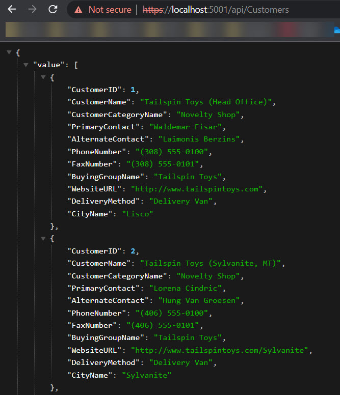
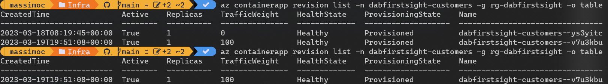

# Generate a REST API from SQL - run on localhost and Azure Container Apps

Install the DAB CLI

https://learn.microsoft.com/en-us/azure/data-api-builder/get-started/get-started-with-data-api-builder

## Create a SQL instance 

Create a SQL database with an empty database.

```
$sid="<your subcription identifier here>"
$rg="<resource group name>"
$administratorPassword="__Holasql4320"

az login
az account set --subscription $sid

# create sql instance and empty database
$result = az deployment group create --resource-group $rg --template-file ./infra/sqldb.bicep --parameters administratorLoginPassword=$administratorPassword | ConvertFrom-Json

# read output values
$sqlServerName = $result.properties.outputs.sqlname.value
$databaseName = $result.properties.outputs.dbname.value
$administratorLogin = $result.properties.outputs.administratorLogin.value

```

## Seed the DB

Seed the database with the WideWorldImporters SQL sample.

```
$bacpac="https://github.com/Microsoft/sql-server-samples/releases/download/wide-world-importers-v1.0/WideWorldImporters-Standard.bacpac"

$localpath="/bacpac/WideWorldImporters-Standard.bacpac"

$sto="holadabcli"

# create storage account
az storage account create --name $sto --resource-group $rg --location westeurope --sku Standard_LRS

# create container
az storage container create --name sql --account-name $sto

# get connection string
$cn = az storage account show-connection-string --name $sto --resource-group $rg --query "connectionString" -o tsv

# upload bacpac to storage account
az storage blob upload --account-name $sto --connection-string $cn --container-name sql --type block --file $localpath

# get storage access key
$key = az storage account keys list --account-name $sto --resource-group $rg --query [0].value -o tsv

# restore bacpac (can take up to 30 mins)
az sql db import -s $sqlServerName -n $databaseName -g $rg -u $administratorLogin -p $administratorPassword --storage-key-type StorageAccessKey --storage-key $key --storage-uri "https://$sto.blob.core.windows.net/sql/WideWorldImporters-Standard.bacpac"

```

## DAB on Localhost

Get the connecton string to the SQL database and initialize the DAB tool.

https://learn.microsoft.com/en-us/azure/data-api-builder/get-started/get-started-azure-sql

```
$sqlCN = az sql db show-connection-string --server $sqlServerName --name $databaseName --client ado.net -o tsv
$sqlCN = $sqlCN.replace('<username>',$administratorLogin).replace('<password>',$administratorPassword)

# initialize the DAB config file
dab init --database-type "mssql" --connection-string $sqlcn --host-mode "Development"

# add the Customers entity (view)
dab add Customers --source Website.Customers --permissions "anonymous:read"  --source.type "view" 

dab start
```

you can now check the API hosted on localhost:5000



## DAB on Azure Container Apps

```
# run the aca.sh script
sh aca.sh
```

The script is creates:
- resource group
- log analytics
- container registry (not used in this example)
- storage account (persistent volume for aca)
- create file share
- upload dab config file to share
- container apps environment
- mount file share on container apps environment
- create container apps application


Before completing, the aca.sh script print out the last steps to complete this exercise.

step 1 - save the ACA application configuration to a YAML file (e.g. edit-volume.yaml)

```
az containerapp show -n dabfirstsight-customers -g rg-dabfirstsight -o yaml > edit-volume.yaml
```

step 2 - update the YAML to introduce volumes, volumeMounts and args

```
# the relevant changes are volumes, volumeMounts and args

    containers:
    - image: mcr.microsoft.com/azure-databases/data-api-builder:latest
      name: dabfirstsight-customers
      args:
        - "--ConfigFileName=./dabconfig/dab-config.json"
      volumeMounts:
      - volumeName: azure-files-volume
        mountPath: /App/dabconfig
    volumes:
    - name: azure-files-volume
      storageType: AzureFile
      storageName: dabconfig
      
```
step 3 - update the ACA application

```
res=$(az containerapp update -n dabfirstsight-customers -g rg-dabfirstsight --yaml edit-volume.yaml)
```

step 4 - check the status of the ACA revision

```
az containerapp revision list -n dabfirstsight-customers -g rg-dabfirstsight -o table
```

The new revision is up an running and the previous revision is eventually phased out.


